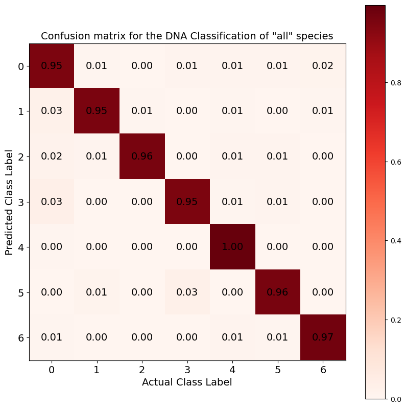
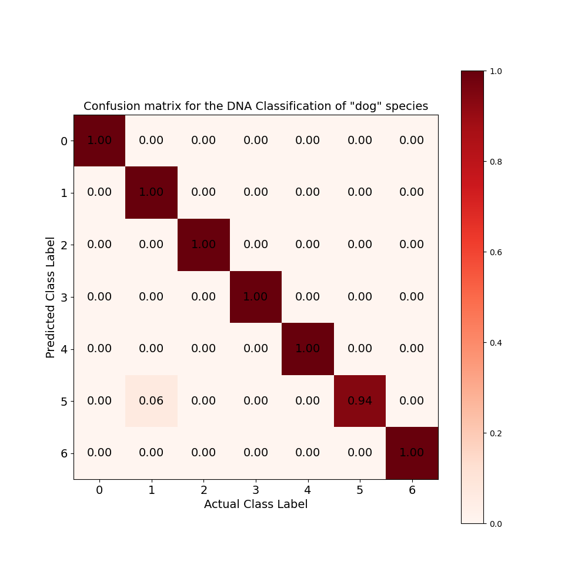

# Project Name: DNA Sequence Classification

## Overview
Recent studies in DNA sequence classification have leveraged sophisticated machine learning techniques, achieving notable accuracy in categorizing complex genomic data. Methods such as k-mer counting have proven effective in distinguishing sequences from varied species like chimpanzees, dogs, and humans. These methods have been used widely in the latest literaure. However, these approaches often demand extensive computational resources. Our study introduces a novel adaptation of Jiang et al.'s compressor-based, parameter-free classification method, specifically tailored for DNA sequence analysis. This approach not only aligns with the current state-of-the-art in terms of accuracy but also offers a more resource-efficient alternative to traditional machine learning methods. A list of different algorithms was used respectively and  our results demonstrate the proposed methods' comparable effectiveness in classifying DNA sequences. 
## Quick Start
```bash
git clone https://github.com/sukruozan/dna-sequence-classification.git
```

## Environment
Conda is a cross platform package and environment manager that installs and manages packages. You can use it to replicate the same environment by simply running the following:

```bash
conda env create -f environment.yml
```

## Dataset
- The original dataset can be reached at this Kaggle post [Demystify DNA Sequencing with Machine Learning](https://www.kaggle.com/code/nageshsingh/demystify-dna-sequencing-with-machine-learning/notebook)
- Here I combined all the data and created a single training and test datasets. For reproduction of the same results you can find the corresponding dataset in the folder [dataset](./dataset/) of this repository.

### Dataset Composition by Species

| Species    | Train Size | Test Size |
|------------|------------|-----------|
| Chimpanzee | 1345       | 337       |
| Human      | 3504       | 876       |
| Dog        | 656        | 164       |
| **Total**  | **5505**   | **1377**  |

### Distribution of Gene Family Samples by Species

| Gene Family                 | Class Label | Chimpanzee | Human | Dog  | **Total** |
|-----------------------------|-------------|------------|-------|------|-----------|
| G protein coupled receptors | 0           | 234        | 531   | 131  | **896**   |
| Tyrosine kinase             | 1           | 185        | 534   | 75   | **794**   |
| Tyrosine phosphatase        | 2           | 144        | 349   | 64   | **557**   |
| Synthetase                  | 3           | 228        | 672   | 95   | **995**   |
| Synthase                    | 4           | 261        | 711   | 135  | **1107**  |
| Ion channel                 | 5           | 109        | 240   | 60   | **409**   |
| Transcription factor        | 6           | 521        | 1343  | 260  | **2124**  |


Class Distribution - All Species | Class Distribution - Human | Class Distribution - Chimpanzee | Class Distribution - Dog
:-----------------------------:|:------------------------:|:------------------------------:|:-----------------------:
 |  |  | 

*Confusion matrices for subspecies classifications: Human, Chimpanzee, and Dog DNA. These matrices detail the classifier's accuracy for each subspecies, highlighting the precision in distinguishing between these specific genomic sequences. The outcomes from the experiments performed by using `brotli` compressor is selected for depiction.*


### Comparison of Compression Algorithms in DNA Sequence Classification

| Algorithm | Computation Time (seconds) | Accuracy | Recall | Precision | F1 Score |
|-----------|----------------------------|----------|--------|-----------|----------|
| Gzip      | 1735.81                    | 0.962    | 0.962  | 0.963     | 0.962    |
| Snappy    | 1726.49                    | 0.932    | 0.932  | 0.933     | 0.932    |
| Brotli    | 12551.60                   | 0.966    | 0.966  | 0.967     | 0.966    |
| LZ4       | 1618.27                    | 0.942    | 0.942  | 0.943     | 0.942    |
| Zstandard | 1560.72                    | 0.930    | 0.930  | 0.935     | 0.931    |
| BZ2       | 2657.35                    | 0.924    | 0.924  | 0.924     | 0.924    |
| LZMA      | 9486.67                    | 0.958    | 0.958  | 0.958     | 0.958    |

### Performance Metrics of Compression Algorithms on DNA Sequence Classification for Different Species

| Algorithm | Chimpanzee Accuracy | Chimpanzee Precision | Chimpanzee Recall | Chimpanzee F1 Score | Human Accuracy | Human Precision | Human Recall | Human F1 Score | Dog Accuracy | Dog Precision | Dog Recall | Dog F1 Score |
|-----------|---------------------|----------------------|-------------------|---------------------|----------------|-----------------|--------------|----------------|--------------|---------------|------------|--------------|
| Gzip      | 0.997               | 0.997                | 0.997             | 0.997               | 0.944          | 0.945           | 0.944        | 0.944          | 0.988        | 0.989         | 0.988      | 0.988        |
| Snappy    | 0.994               | 0.994                | 0.994             | 0.994               | 0.943          | 0.944           | 0.943        | 0.943          | 0.744        | 0.748         | 0.744      | 0.745        |
| Brotli    | 1.000               | 1.000                | 1.000             | 1.000               | 0.947          | 0.950           | 0.947        | 0.948          | 0.994        | 0.994         | 0.994      | 0.994        |
| LZ4       | 0.997               | 0.997                | 0.997             | 0.997               | 0.944          | 0.946           | 0.944        | 0.944          | 0.817        | 0.829         | 0.817      | 0.819        |
| Zstandard | 0.994               | 0.994                | 0.994             | 0.994               | 0.900          | 0.909           | 0.900        | 0.901          | 0.963        | 0.967         | 0.963      | 0.963        |
| BZ2       | 0.985               | 0.985                | 0.985             | 0.985               | 0.893          | 0.894           | 0.893        | 0.893          | 0.963        | 0.966         | 0.963      | 0.964        |
| LZMA      | 1.000               | 1.000                | 1.000             | 1.000               | 0.936          | 0.937           | 0.936        | 0.936          | 0.988        | 0.989         | 0.988      | 0.988        |


Confusion Matrix - All Species | Confusion Matrix - Human | Confusion Matrix - Chimpanzee | Confusion Matrix - Dog
:-----------------------------:|:------------------------:|:------------------------------:|:-----------------------:
 |  |  | 

*Confusion matrices for subspecies classifications: Human, Chimpanzee, and Dog DNA. These matrices detail the classifier's accuracy for each subspecies, highlighting the precision in distinguishing between these specific genomic sequences. The outcomes from the experiments performed by using `brotli` compressor is selected for depiction.*

## K-Mer distribution in Class 6 sequences of Human genome


## Support
If you need help or have a question, raise an issue or contact me at sukruozan@gmail.com.

## Contributors
- [Sukru Ozan](https://sukruozan.com)

To cite this work in your publications, use the following BibTeX entry:


## Citation

      @article{ozan2024dna,
            title={DNA Sequence Classification with Compressors}, 
            journal={arXiv},
            author={Şükrü Ozan},
            year={2024},
            eprint={2401.14025},
            archivePrefix={arXiv},
            primaryClass={q-bio.GN},
            doi={https://doi.org/10.48550/arXiv.2106.10899}
      }


## References
1. Jaddi, N. S., & Saniee Abadeh, M. (2022). "Cell separation algorithm with enhanced search behaviour in miRNA feature selection for cancer diagnosis." Information Systems, 104, 101906. [DOI](http://dx.doi.org/10.1016/j.is.2021.101906)
2. Khan, S., Khan, M., Iqbal, N., Li, M., & Khan, D. M. (2020). "Spark-Based Parallel Deep Neural Network Model for Classification of Large Scale RNAs into piRNAs and Non-piRNAs." IEEE Access, 8, 136978–136991. [DOI](http://dx.doi.org/10.1109/ACCESS.2020.3011508)
3. Yagin, F. H., et al. (2023). "Explainable artificial intelligence model for identifying COVID-19 gene biomarkers." Computers in Biology and Medicine, 154, 106619. [DOI](https://doi.org/10.1016/j.compbiomed.2023.106619)
4. Wen, J., et al. (2019). "A classification model for lncRNA and mRNA based on k-mers and a convolutional neural network." BMC Bioinformatics, 20(1). [DOI](http://dx.doi.org/10.1186/s12859-019-3039-3)
5. Millán Arias, P., et al. (2022). "DeLUCS: Deep learning for unsupervised clustering of DNA sequences." PLOS ONE, 17(1), e0261531. [DOI](http://dx.doi.org/10.1371/journal.pone.0261531)
6. Bentley, J. L., et al. (1986). "A locally adaptive data compression scheme." Communications of the ACM, 29(4), 320–330. [DOI](http://dx.doi.org/10.1145/5684.5688)
7. Burrows, M. (1994). "A block-sorting lossless data compression algorithm." SRS Research Report, 124.
8. Huffman, D. (1952). "A Method for the Construction of Minimum-Redundancy Codes." Proceedings of the IRE, 40(9), 1098–1101. [DOI](http://dx.doi.org/10.1109/JRPROC.1952.273898)
9. Ziv, J., & Lempel, A. (1977). "A universal algorithm for sequential data compression." IEEE Transactions on Information Theory, 23(3), 337-343. [DOI](10.1109/TIT.1977.1055714)
10. Alberts, B. (2014). "Molecular biology of the cell." 6th ed. New York, NY: Garland Publishing.
11. Li, M., et al. (2004). "The similarity metric." IEEE Transactions on Information Theory, 50(12), 3250–3264. [DOI](https://doi.org/10.1109/TIT.2004.838101)
12. Jiang, Z., et al. (2023). "Low-Resource Text Classification: A Parameter-Free Classification Method with Compressors." Findings of the Association for Computational Linguistics: ACL 2023, Toronto, Canada. [Link](https://aclanthology.org/2023.findings-acl.426)
13. Juneja, S., et al. (2022). "An Approach to DNA Sequence Classification Through Machine Learning: DNA Sequencing, K Mer Counting, Thresholding, Sequence Analysis." International Journal of Reliable and Quality E-Healthcare, 11(2), 1–15. [DOI](http://dx.doi.org/10.4018/ijrqeh.299963)
14. Orozco-Arias, S., et al. (2021). "K-mer-based machine learning method to classify LTR-retrotransposons in plant genomes." PeerJ, 9, e11456. [DOI](http://dx.doi.org/10.7717/peerj.11456)
15. Sarkar, B. K., et al. (2021). "Determination of k-mer density in a DNA sequence and subsequent cluster formation algorithm based on the application of electronic filter." Scientific Reports, 11(1). [DOI](http://dx.doi.org/10.
16. Ozan, S. (2023). "DNA Sequence Classification." [GitHub Repository](https://github.com/sukruozan/DNA-Sequence-Classification)
17. Singh, N. (2023). "Demystify DNA Sequencing with Machine Learning." [Kaggle Notebook](https://www.kaggle.com/code/nageshsingh/demystify-dna-sequencing-with-machine-learning/notebook)
18. Singh, N. (2023). "DNA Sequence Dataset." [Kaggle Dataset](https://www.kaggle.com/datasets/nageshsingh/dna-sequence-dataset)
